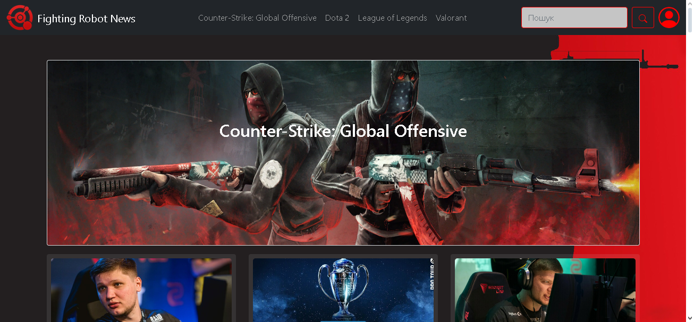
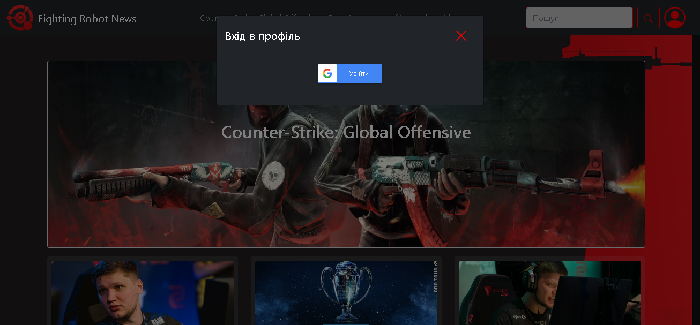
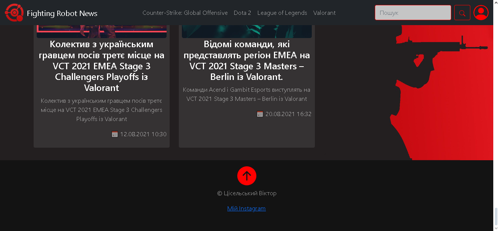
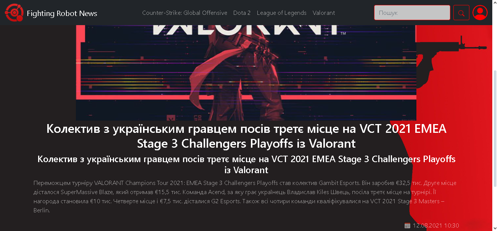
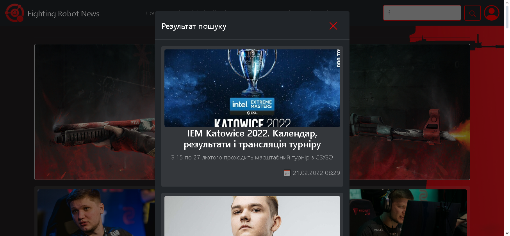

<p align="center"></p>
<h1 align="center">fighting-robots-news</h1>

## Description
<b>EN:</b>

This is a revised version of the course project that was ordered from me ([fighting-robots-news](https://github.com/CoolOtaku/fighting-robots-news)).

The project visualizes the work of a news site on the topic of eSports. Using its own **API**.

<b>UA:</b>

Це доопрацьована версія курсового проекту який в мене заказали ([fighting-robots-news](https://github.com/CoolOtaku/fighting-robots-news)).

Проект візуалізує роботу новинного сайту на тему кіберспорту. З використанням власного **API**.

#
## Screenshots
<p>
  
  
  
  
  
</p>

#
## Technologies used
<b>EN:</b>
- Using [**Bootstrap**](https://getbootstrap.com) (front-end framework)
- Using a third-party template for site layout (built on [**Bootstrap**](https://getbootstrap.com))
- Using the library [**jQuery**](https://jquery.com)
- Using the library [**SweetAlert2**](https://sweetalert2.github.io)
- Using the ***Cookie*** system
- Using a **MySQL** database
- Creating your own **API**
- Authorization through **Google**
- Search for information and navigation on the site

<b>UA:</b>
- Використання [**Bootstrap**](https://getbootstrap.com) (front-end framework)
- Використання стороннього шаблону для макета сайту (на основі [**Bootstrap**](https://getbootstrap.com))
- Використання бібліотеки [**jQuery**](https://jquery.com)
- Використання бібліотеки [**SweetAlert2**](https://sweetalert2.github.io)
- Використання системи ***Cookie***
- Використання бази даних **MySQL**
- Створення власного **API**
- Авторизація через **Google**
- Пошук інформації та навігація по сайту

#
## License
```
© 2022, CoolOtaku (ericspz531@gmail.com)
```
